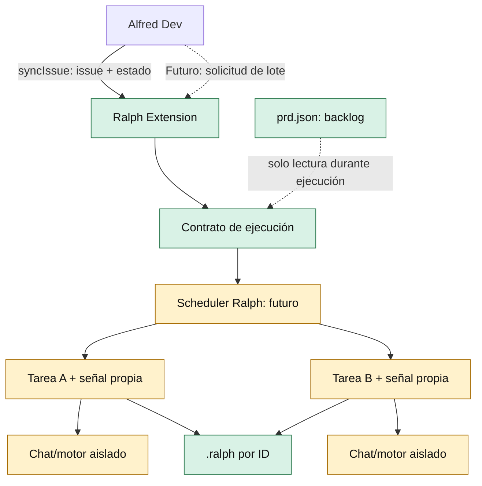

# ADR-016: Dispatch paralelo propiedad del runner

- **Estado:** propuesto
- **Fecha:** 19 de septiembre de 2026

## Contexto

`alfred-dev-vscode#3` agrupa dos entregables distintos: la sincronización explícita de
issues GitHub con Ralph y el dispatch de varias tareas hacia Ralph Runner.

La sincronización (`ralph-suite.syncIssue`) ya tiene un contrato público y acotado:
recibe un número de issue, un estado Ralph y una raíz de workspace validada. No
modifica `prd.json` y usa `.ralph/` como runtime.

El runner actual no tiene un contrato de dispatch paralelo. `KanbanPanel` mantiene
un único `AbortController`, `runTaskWithRetry` abre la superficie de Chat de VS Code,
marca el estado en `.ralph` y espera el resultado mediante polling. Alfred solo puede
invocar el comando público `ralph-suite.runTask`; no puede crear sesiones de Chat
aisladas ni controlar el estado interno del panel.

Restricciones relevantes:

- `prd.json` es el backlog local y no debe ser modificado por la ejecución agentica.
- `.ralph/` contiene señales y logs por ID local; el ID debe conservarse literalmente.
- El workspace debe ser de confianza antes de cualquier operación mutable o de ejecución.
- El abort actual pertenece al runner/panel completo, no a una tarea individual.
- GitHub es la fuente colaborativa; Ralph trabaja con el backlog local.

## Opciones consideradas

### Opción A: scheduler paralelo dentro de Ralph Runner

Ralph aceptaría un lote o una capacidad de dispatch y coordinaría la concurrencia.

**Ventajas:**

- La propiedad de estados, dependencias, abort y logs permanece en Ralph.
- Permite diseñar leases por tarea, límites de concurrencia y observabilidad coherente.
- Alfred conserva una integración pequeña y estable.

**Inconvenientes:**

- Requiere un contrato nuevo para sesiones de Chat independientes o un motor de
  ejecución que no dependa de la única superficie de Chat actual.
- Exige resolver colisiones de workspace, memoria compartida, logs y checkpoints.
- No es un cambio local: afecta al runner, al panel, al contrato público y a los tests.

### Opción B: Alfred invoca `ralph-suite.runTask` N veces en paralelo

Alfred leería los IDs elegibles y ejecutaría varias llamadas al comando existente.

**Ventajas:**

- Cambio superficial en Alfred.
- Reutiliza el comando público actual.

**Inconvenientes:**

- Las llamadas comparten el `KanbanPanel`, el Chat de VS Code y el `AbortSignal`.
- Varias lecturas pueden seleccionar o iniciar tareas con una visión obsoleta del PRD.
- `stopRunner` cancelaría todas las tareas que compartan la señal del panel.
- No existe una garantía de que `workbench.action.chat.open` mantenga contextos
  separados; los prompts podrían competir en una única conversación.
- Multiplica escrituras de estado y refrescos sin lease ni coordinación atómica.
- Tras un timeout o un fallback al portapapeles, Alfred no tendría una semántica
  fiable de éxito por tarea.

### Opción C: recortar el alcance actual a `syncIssue`

Publicar y validar `ralph-suite.syncIssue`, dejando el scheduler paralelo fuera del
entregable actual.

**Ventajas:**

- Entrega el contrato determinista ya implementado.
- No amplía la superficie de ejecución ni introduce carreras nuevas.
- Permite que el futuro scheduler se diseñe como una capacidad propia de Ralph.

**Inconvenientes:**

- `alfred-dev-vscode#3` queda parcialmente resuelto.
- No hay aumento de throughput hasta definir el contrato de ejecución paralelo.

## Decisión

Se elige la **Opción C**: recortar el alcance de #3 a `syncIssue` y no implementar
por ahora dispatch paralelo, ni desde el runner actual ni mediante N llamadas
concurrentes de Alfred.

Cuando se retome el paralelismo, la dirección preferida será la **Opción A**:
Ralph debe ser dueño de un scheduler acotado. Alfred podrá solicitar una operación
con un contrato explícito, pero no orquestará carreras llamando repetidamente a
`runTask`.

El scheduler futuro debe introducir, como mínimo:

- lease o reserva por tarea antes de iniciar ejecución;
- límite de concurrencia configurable y por workspace;
- `AbortSignal` independiente por tarea y abort global explícito;
- contexto de Chat o motor de ejecución aislado por tarea;
- resultados terminales idempotentes (`completed`, `failed`, `blocked`) y logs por ID;
- validación de trust y raíz de workspace antes de crear ejecuciones;
- prohibición explícita de modificar `prd.json` durante la ejecución;
- recuperación tras reinicio sin duplicar tareas ni perder estados.

### Diagrama de límites

**Leyenda:** flecha sólida = contrato o dependencia operativa; flecha discontinua =
capacidad futura o lectura; verde = existente en el alcance actual; amarillo =
diseño pendiente, no implementado.

## Criterios de aceptación

### Para cerrar el alcance actual

- `ralph-suite.syncIssue` está contribuido y anunciado por Ralph.
- Alfred detecta la capacidad exacta y no declara una dependencia obligatoria.
- El mapeo acepta `github:#N` y `owner/repo#N`, exige unicidad y conserva el ID local.
- Trust, raíz multi-root y estados inválidos se rechazan antes de mutar runtime.
- La operación no escribe `prd.json`, no crea señales `completed`/`NOTA:` y solo
  actualiza `.ralph` según el estado solicitado.
- Tests de Ralph y Alfred cubren contrato, trust, mapeo, errores y ausencia de Ralph.

### Para reabrir el dispatch paralelo

No se considerará aceptado hasta que exista una API documentada y tests que
verifiquen leases, aislamiento de contexto, concurrencia limitada, abort por tarea,
abort global, reinicio, workspace trust, multi-root, dependencias y ausencia de
escrituras del PRD. También requerirá validación de seguridad específica y una
revisión de la compatibilidad real de la API de Chat o del motor elegido.

## Consecuencias

Se acepta que #3 no entrega paralelismo todavía. A cambio, el sistema conserva una
semántica de ejecución serial y observable, sin fingir que varias llamadas a un
comando diseñado para una única conversación son aislamiento real.

La deuda explícita es diseñar un contrato de scheduler antes de aumentar throughput.
Si no se hace ese trabajo, no ocurre una degradación grave: permanece disponible la
sincronización determinista y el runner serial actual.
