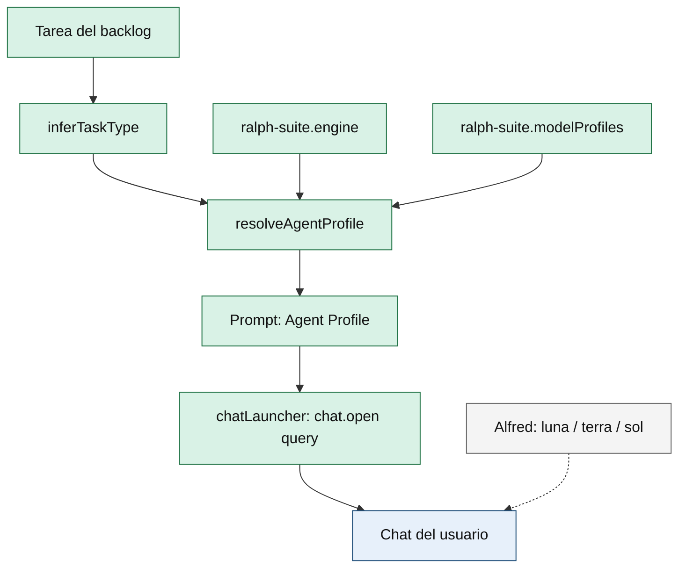

# ADR-017: Simplificar `modelProfiles` (vocabulario Ralph, recomendación honesta)

- **Estado:** aceptado
- **Fecha:** 21 de septiembre de 2026
- **Autor:** architect
- **Issue:** [SrScorpio/ralph-suite#10](https://github.com/SrScorpio/ralph-suite/issues/10)
- **Supersede parcialmente:** ADR-007 (el mapeo `taskType` → perfil y la inyección en prompt se conservan; cambian defaults, vocabulario y honestidad del contrato)

## Contexto

`ralph-suite.modelProfiles` nació en ADR-007: inferir un `taskType` y resolver un perfil `{ engine, model, mode }` que se inyecta en el prompt. La extensión **no fuerza** el modelo en el proveedor de chat.

El setting, tal como está en `package.json` 1.11.2, tiene tres problemas de producto:

1. **Defaults obsoletos.** `gpt-5`, `gpt-5-codex` y el modo `security-audit` no son un catálogo actual ni un modo real de Chat. El perfil `default` ya usa `model: ""`; los demás no.
2. **Mezcla de vocabularios.** Ralph habla de `engine` (`copilot` / `codex` / `claude` / `opencode`) y `mode` (`execute` / `review`). Alfred Dev habla de paleta de coste `luna` / `terra` / `sol` (`alfred-dev.modelProfile` y arrays `model:` de cada agente). No son el mismo eje.
3. **Contrato inflado.** `ralph-suite.engine` y `modelProfiles.*.engine` se describen como «motor para ejecutar». En runtime, `chatLauncher.ts` solo abre `workbench.action.chat.open` con `{ query, isPartialQuery }`. El motor y el modelo salen en la sección `## Agent Profile` del prompt. El Kanban no tiene selector: el botón Settings abre `workbench.action.openSettings` filtrado a `ralph-suite`.

Hechos del código (alcance de este ADR, no de implementación):

- `inferTaskType` en `src/promptBuilders.ts` clasifica `security | review | bugfix | test | docs | refactor | default`.
- `resolveAgentProfile` solo busca claves en `modelProfiles`; si faltan (`test`, `docs`, `refactor`), cae a `profiles.default` y luego a `ralph-suite.engine` + `model: ""` + `mode: execute`.
- Los defaults actuales solo declaran `default`, `bugfix`, `review`, `security`.
- No hay tests de `inferTaskType` / `resolveAgentProfile`.
- `package.nls.json` / `package.nls.es.json` no cubren `modelProfiles` (descripción hardcodeada en inglés en `package.json`).

Restricciones:

- Ralph es una extensión **independiente**. No puede exigir Alfred para recomendar motor o modo.
- No forzar modelo en proveedores que no lo permiten; no fingir un router de Chat que no existe.
- No tocar `prd.json`, `syncIssue` ni el scheduler (ADR-016).
- No reescribir `plans/arquitectura.md` en esta fase (checkpoint); este ADR es la fuente de la decisión.

## Opciones evaluadas

### Opción A: Ralph recomienda motor / modelo / modo, sin paleta Alfred

Conservar `ralph-suite.engine` y `ralph-suite.modelProfiles` como **tabla de recomendación** con vocabulario solo Ralph. Actualizar defaults a valores actuales y honestos. Esquematizar el objeto para que Settings sea menos opaco. Seguir inyectando el perfil en el prompt; no añadir selector en el Kanban.

**Ventajas:**

- Ralph sigue siendo usable sin Alfred.
- Repara el problema real (defaults muertos y modo inventado) sin inventar un puente entre productos.
- Mantiene ADR-007: inferencia por tipo de tarea + recomendación explícita.
- Superficie pequeña: `package.json`, NLS, `promptBuilders.ts`, tests, README. El Kanban no necesita UI nueva.

**Desventajas:**

- El objeto JSON en Settings no desaparece del todo (VS Code no pinta bien objetos anidados).
- Quien use Alfred y Ralph verá dos sitios de «perfil» (coste Alfred vs recomendación Ralph). Eso es correcto: no son el mismo concepto.
- Los overrides de usuario con `gpt-5` / `security-audit` no se migran solos; hay que documentar y normalizar modos desconocidos a `execute`.

### Opción B: Alfred único sitio de perfil; Ralph deja de duplicar defaults

Deprecar o vaciar `modelProfiles`. El coste/modelo vive en `alfred-dev.modelProfile` y en los `agents/*.agent.md`. Ralph como mucho conserva `engine` mínimo, o también lo depreca, e inyecta solo `taskType` / modo inferido.

**Ventajas:**

- Un solo sitio de paleta para quien vive en el equipo Alfred.
- Menos JSON en Ralph.

**Desventajas:**

- Ralph deja de ser autónomo: un usuario solo-Ralph no tiene recomendación de motor/modelo, o hereda un setting de otra extensión que puede no estar instalada.
- `luna` / `terra` / `sol` no mapean a `copilot` / `codex` / `claude` / `opencode`. Acoplarlos sería traducir ejes distintos.
- Rompe el contrato de ADR-007 para un problema de defaults, no de diseño.
- `ralph-suite.engine` hoy ya es solo recomendación; vaciar perfiles no simplifica el launcher.

### Opción C: híbrido (traducir Alfred ↔ Ralph)

Mantener `modelProfiles` y, si Alfred está presente, proyectar `luna`/`terra`/`sol` sobre engine/modelo, o duplicar ambos settings sincronizados.

**Ventajas:**

- Ilusión de un único dial para quien usa las dos extensiones.

**Desventajas:**

- Sobreingeniería. Dos fuentes de verdad, acoplamiento temporal entre productos y un mapa que hay que actualizar cada vez que Alfred cambie el catálogo de modelos.
- El Kanban y el launcher seguirían sin forzar el modelo.
- Qué pasaría si no se hace: nada grave. El usuario elige el agente Alfred y, aparte, lee la recomendación Ralph. No hay pérdida de función.

**Veredicto sobre C:** es over-engineering. Se descarta. Propongo una capa de abstracción sobre la capa de abstracción… no.

## Matriz de decisión

Pesos: independencia de Ralph (0.25), honestidad del contrato (0.20), DX de settings (0.20), YAGNI / superficie (0.15), continuidad con ADR-007 (0.10), coste de implementación (0.10). Puntuación 1–10.

| Criterio | Peso | A | B | C |
|---|---:|---:|---:|---:|
| Independencia de Ralph | 0.25 | 9 | 3 | 4 |
| Honestidad (recomendación, no router) | 0.20 | 9 | 6 | 4 |
| DX / claridad | 0.20 | 8 | 6 | 3 |
| YAGNI / superficie | 0.15 | 8 | 7 | 2 |
| Continuidad ADR-007 | 0.10 | 9 | 3 | 4 |
| Coste de implementación | 0.10 | 8 | 6 | 3 |
| **Total ponderado** |  | **8.55** | **5.15** | **3.35** |

## Decisión

Se propone la **Opción A**.

Ralph sigue recomendando `engine` / `model` / `mode` por `taskType`. Alfred no entra en este setting. El Kanban no gana un selector de perfil. El launcher no gana un router de proveedor.

### Contrato de vocabulario (Ralph)

| Campo | Valores | Notas |
|---|---|---|
| `engine` | `copilot` \| `codex` \| `claude` \| `opencode` | Recomendación de superficie de chat, no un switch real. |
| `model` | string libre, default `""` | Vacío = default del proveedor. Nunca paleta `luna`/`terra`/`sol`. |
| `mode` | `execute` \| `review` | Se elimina `security-audit`. Tareas `security` usan `execute` (hacer el arreglo) salvo override del usuario. |
| `taskType` | `default` \| `bugfix` \| `review` \| `security` \| `test` \| `docs` \| `refactor` | Inferido. Solo las cuatro primeras tienen fila en el default del setting; el resto cae a `default`. |

### Defaults propuestos

```json
{
  "default":  { "engine": "copilot", "model": "", "mode": "execute" },
  "bugfix":   { "engine": "copilot", "model": "", "mode": "execute" },
  "review":   { "engine": "copilot", "model": "", "mode": "review" },
  "security": { "engine": "copilot", "model": "", "mode": "execute" }
}
```

Por qué `model: ""` en todos: es el único default que no caduca. Los nombres de modelo viven en el picker del proveedor y en Alfred, no en Ralph.

Por qué no se mantiene `engine: "codex"` en bugfix/review/security: hoy no hay routing; recomendar Codex mientras el usuario está en Copilot es ruido. Quien quiera Codex lo pone en `ralph-suite.engine` o en un override de perfil.

### Resolución

1. `taskType = inferTaskType(task)`.
2. `selected = modelProfiles[taskType] ?? modelProfiles.default ?? {}`.
3. `engine = selected.engine ?? ralph-suite.engine ?? "copilot"` (allowlist; desconocido → `copilot`).
4. `model = typeof selected.model === "string" ? selected.model.trim() : ""`.
5. `mode = selected.mode` si es `execute` o `review`; si no, `review` cuando `taskType === "review"`, en otro caso `execute`.
6. Prompt: sección `## Agent Profile` con engine, modelo (o «provider default»), mode, taskType, y la nota de que es recomendación manual si el proveedor no se puede forzar.

## Diagrama



**Leyenda:** verde = Ralph (inferencia + settings + prompt + launcher). Azul = el usuario elige de verdad el modelo en Chat. Gris = Alfred, fuera de este contrato; no hay flecha de datos hacia `modelProfiles`. Flecha discontinua = coexistencia, no dependencia.

Separación de responsabilidades. No es negociable.

## Impacto de implementación (fuera de este ADR; guía para junior-dev)

No se implementa código de producto hasta que el usuario acepte este ADR.

### `package.json` `contributes.configuration`

- `ralph-suite.engine`: descripción NLS honesta («recomendación de motor inyectada en el prompt; no cambia el proveedor de Chat»).
- `ralph-suite.modelProfiles`:
  - `default` según la tabla de arriba.
  - `markdownDescription` / NLS: recomendación por tipo; no fuerza el modelo; vocabulario Ralph; no usar luna/terra/sol.
  - JSON Schema: `properties` para `default|bugfix|review|security`; cada uno con `engine` enum, `model` string, `mode` enum `execute|review`. `additionalProperties` permitido (objeto con las mismas tres claves) para no romper perfiles extra del usuario.
- No deprecar la clave: se simplifica, no se elimina.

### `src/promptBuilders.ts`

- Conservar `inferTaskType` y `resolveAgentProfile`; exportarlos para tests (o testear vía `buildPrompt`).
- Allowlist de `engine` y `mode`; `security-audit` y cualquier otro modo → reglas de resolución de arriba.
- No leer `alfred-dev.modelProfile`.
- No interpolar `model` / `engine` / `mode` sin recortar control chars (settings son input de usuario).

### UI Kanban

- **Sin cambios de producto.** No hay picker de perfil en tarjetas ni en la barra.
- El botón Settings sigue abriendo la configuración de `ralph-suite`.
- Fuera de alcance: selector por tarea (deuda nombrada en ADR-007). YAGNI mientras el perfil sea recomendación global por tipo.

### Tests y docs

- Tests nuevos: inferencia por señales; fallback `test`/`docs`/`refactor` → `default`; override de perfil; `model` vacío; modo inválido; ausencia de paleta Alfred en prompt.
- README + NLS EN/ES alineados (ADR-015: lo declarado funciona y está traducido).
- No modificar `prd.json`. No reescribir `plans/arquitectura.md` en el mismo PR salvo que el usuario abra ese checkpoint.

### Migración

- Usuario sin override: recibe los nuevos defaults en la próxima versión.
- Usuario con `gpt-5` / `security-audit` en `settings.json`: VS Code conserva el valor de usuario. El código ignora modos fuera de enum. Changelog: cómo volver a `model: ""` y `mode: execute|review`.
- No hay script de migración ni borrado de settings.

## Consecuencias

### Positivas

- Un modelo mental: Ralph recomienda; Chat ejecuta; Alfred no se copia.
- Defaults que no mienten.
- ADR-007 sigue vivo sin arrastrar nombres de modelo.

### Negativas / deuda asumida

- Settings de objeto JSON sigue siendo menos ergonómico que un enum. Aceptable frente a aplanar cuatro×tres claves o inventar un editor custom.
- No hay routing real de motor. Si VS Code expone algún día una API estable de modelo, hará falta **otro** ADR; este no lo finge.
- Doble dial para quien usa Alfred + Ralph. Es el precio de no acoplar productos.

### Qué pasaría si no se hace

El setting seguiría ofreciendo `gpt-5` y `security-audit`, y el solapamiento verbal con Alfred seguiría confundiendo. No hay incidente de seguridad, pero el contrato con el usuario sigue siendo falso.

## Criterios de aceptación (para el PR de implementación, no para este ADR)

- Defaults sin `gpt-5`, `gpt-5-codex` ni `security-audit`.
- Ninguna cadena `luna` / `terra` / `sol` en configuración, prompts o UI de Ralph.
- Prompt documenta que engine/modelo/modo son recomendación.
- `inferTaskType` + resolución cubiertos por tests.
- Kanban sin UI nueva de perfiles.
- NLS EN/ES de `engine` y `modelProfiles`.
- Changelog de migración para overrides antiguos.

## Relación con seguridad

No hay vector nuevo de red ni de secretos. El riesgo residual es interpolar settings en el prompt: allowlist de enums y recorte de `model` bastan. No se abre el checkpoint de «cambiar configuración de autenticación o seguridad».

## Referencias

- `plans/decisiones.md` — ADR-007, ADR-015
- `docs/adr/ADR-016-dispatch-paralelo-propiedad-del-runner.md` — fuera de alcance
- `src/promptBuilders.ts` — `inferTaskType`, `resolveAgentProfile`, `buildPrompt`
- `src/chatLauncher.ts` — `workbench.action.chat.open`
- `src/webview/kanbanHtml.ts` / `src/kanbanPanel.ts` — `openSettings`
- `package.json` — `ralph-suite.engine`, `ralph-suite.modelProfiles`
- Alfred (fuera de este repo): `alfred-dev.modelProfile` enum `luna|terra|sol`
