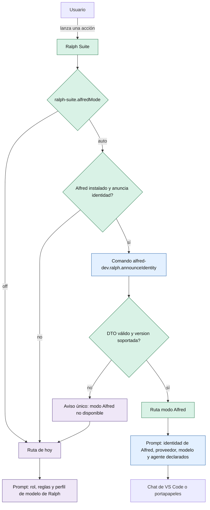

# ADR-018: Modo Alfred en Ralph — detección, ajuste, qué se silencia y quién posee `AGENTS.md`

- **Estado:** aceptado

> Corrección 2026-10-03. Ralph no valida ni escribe proveedor ni modelo. El DTO solo trae agente, mención y preámbulo. Si trae `provider` o `model`, el DTO entero se rechaza y se usa la ruta de hoy. El modelo lo elige la ficha del subagente.

- **Fecha:** 3 de octubre de 2026
- **Autor:** architect (Alfred Dev)
- **Feature:** `alfred-mode`
- **Relacionado:** ADR-016 (dispatch paralelo), ADR-017 (`modelProfiles`; este ADR lo **acota**, no lo supersede), [ADR-003 de `SrScorpio/alfred-dev-vscode`](https://github.com/SrScorpio/alfred-dev-vscode) (identidad que Alfred anuncia), ADR-002 de Alfred (carpeta de workspace en multi-root).

## Contexto

En una ventana multi-root con `SrScorpio.alfred-dev-vscode` y `ralph-suite` instaladas, Ralph impone su identidad al equipo Alfred. Evidencia en el código de este repo:

| Punto | Qué hace hoy |
|---|---|
| `src/promptBuilders.ts` (`buildPrompt`, `resolveAgentProfile`) | Inyecta `## Agent Profile` con `engine`, `model`, `mode` y `taskType`, más `guardrails` y `boundaries` |
| `src/promptBuilders.ts` (`buildInitPrompt` → `agentsMdBuilders.buildInitPromptText`) | El prompt de init instruye a generar `AGENTS.md` como fichero 1 del paquete |
| `src/kanbanPanel.ts` (`getBoardConfig`) | Publica `guardrails` y `boundaries` al webview, que los pinta en el panel «Guardrails & Boundaries» (`src/webview/kanbanHtml.ts`) |
| `src/commands/project.ts` (`setupProject`) | Escribe `AGENTS.md` y seis ficheros más con rol, stack y proyecto de Ralph (`src/agentsMdBuilders.ts`) |
| `src/commands/memory.ts` (`buildOptimizePrompt`) | Prompt genérico («You are helping maintain a project memory file…») sin rol, sin agente y sin declarar proveedor ni modelo |
| `src/kanban/analyzeProject.ts` | Sigue listando `plans/` entre las fuentes a inspeccionar |

Alfred **ya** resuelve a Ralph (`RalphBridge`, `RALPH_SUITE_EXTENSION_ID`, `resolveRalphSuiteExtension`). En sentido contrario no existe nada: no hay una sola referencia a `alfred-dev` en `src/` (solo en tests).

Decisiones de producto cerradas por el usuario. No se reabren aquí:

- **P1** — el modo arranca solo al detectar Alfred Dev y se apaga con el ajuste. Sin Alfred, Ralph se comporta como hoy.
- **P2** — el botón de generar `AGENTS.md` sigue visible y bloqueado, con aviso de quién es el dueño. No se oculta.
- **P3** — los overrides que citan `/plan/` o `plans/` solo se avisan. No hay acción de limpieza. No se escribe `settings.json`.

Restricciones que condicionan el diseño:

- Cero cambio de comportamiento si Alfred no está instalado o el modo está en `off`. Test de no-regresión obligatorio.
- Ralph no escribe ajustes de otras extensiones y no lee los ajustes de Alfred como si fueran suyos.
- Un único propietario por artefacto: en modo Alfred, Ralph no pisa `AGENTS.md`.
- `prd.json` sigue siendo el backlog humano; la ejecución agéntica no lo modifica.
- Multi-root y workspaces no confiables deben seguir funcionando: resolver el modo no puede exigir trust ni escribir en disco.

## Opciones consideradas

### Opción A: Ralph decide el modo y sonda la identidad a Alfred

Ralph resuelve el ajuste, detecta la extensión por id, llama al comando público de identidad de Alfred, valida la respuesta y aplica él mismo el silenciado y el bloqueo de `AGENTS.md`.

**Ventajas:**

- Una sola fuente de verdad de la identidad: Alfred. Ralph no copia ni traduce vocabularios (`luna`/`terra`/`sol` no se proyectan, como ya decidió ADR-017).
- Propiedad clara: Ralph posee el comportamiento de inyección; Alfred posee el contenido que se inyecta.
- Reversible de verdad: el interruptor está en Ralph y no depende de que la otra extensión coopere.
- Fallo explícito: si la identidad no llega o no valida, se cae a la ruta de hoy con aviso, nunca a un modo a medias.

**Inconvenientes:**

- Superficie nueva: un comando entrante de otra extensión y su validación.
- Ralph pasa a tener dos rutas de construcción de prompt (hoy y modo Alfred) que hay que mantener y testear juntas.
- La resolución de identidad es una llamada a otro host de extensión: introduce un punto de fallo adicional (mitigado por timeout y por el fallback).

### Opción B: Alfred escribe o proyecta los ajustes de Ralph

Alfred escribiría `ralph-suite.guardrails`, `boundaries`, `agentRole`, `modelProfiles`… o los vaciaría para «ceder la voz».

**Ventajas:**

- Cero cambios en Ralph: el silenciado sería un efecto colateral de la configuración.

**Inconvenientes:**

- Escritura cross-extension de ajustes ajenos: dos dueños del mismo ajuste y un dial del usuario que deja de ser el suyo.
- Acoplamiento temporal: el comportamiento de Ralph dependería de que Alfred esté activo y de cuándo escriba.
- Irreversible en la práctica: al desinstalar o desactivar Alfred, los ajustes quedan «prestados» por otra extensión.
- Contradice ADR-017 (Ralph es una extensión independiente y no puede exigir Alfred) y la restricción P3 de no escribir configuración.

### Opción C: identidad compartida en un fichero del workspace

Alfred escribiría, p. ej., `.ralph/alfred-identity.json` y Ralph lo leería.

**Ventajas:**

- No hay comando entre extensiones ni activación previa: es un fichero.

**Inconvenientes:**

- Una extensión escribe en el runtime de la otra: el acoplamiento pasa del contrato al disco.
- Un fichero se queda obsoleto y falla **en silencio**: identidad vieja, versiones divergentes, nada obliga a regenerarlo.
- Hay que decidir ubicación, `.gitignore`, conflictos multi-root y qué pasa cuando dos carpetas traen identidades distintas.
- El fichero sobrevive a la desinstalación de Alfred: Ralph leería una identidad fantasma.

### Opción D: no hacer nada

**Ventajas:**

- Coste cero, cero riesgo, cero superficie.

**Inconvenientes:**

- No resuelve el problema. El PRD documenta que el fallo **ya ocurrió**: el `AGENTS.md` de `alfred-dev-vscode` está commiteado con cabecera «Generated: 2026-10-03 by Ralph Suite», rol `Senior Software Engineer` y reglas de `plan/`.

Se descarta sin pasar por la matriz la variante «Ralph copia la tabla de identidad de Alfred»: serían dos fuentes de verdad que divergen en la primera release, y el día que el catálogo de agentes cambie, Ralph mentirá con seguridad.

## Matriz de decisión

Pesos: resolver el problema real de identidad única (0.25), una sola fuente de verdad sin duplicar vocabularios (0.20), superficie y seguridad —cero escrituras cruzadas— (0.20), independencia y reversibilidad de Ralph (0.15), coste de implementación (0.10), continuidad con ADR-016/ADR-017 (0.10). Puntuación 1–10.

| Criterio | Peso | A | B | C | D |
|---|---:|---:|---:|---:|---:|
| Resuelve el problema real | 0.25 | 9 | 4 | 6 | 1 |
| Una sola fuente de verdad | 0.20 | 9 | 3 | 5 | 2 |
| Superficie / seguridad | 0.20 | 9 | 2 | 5 | 10 |
| Independencia y reversibilidad | 0.15 | 9 | 3 | 6 | 10 |
| Coste de implementación | 0.10 | 7 | 8 | 6 | 10 |
| Continuidad ADR-016/017 | 0.10 | 9 | 3 | 5 | 10 |
| **Total ponderado** |  | **8.80** | **3.55** | **5.50** | **6.15** |

Lectura honesta de la matriz: «no hacer nada» gana en coste y en seguridad porque no toca nada; pierde donde importa (0.45 del peso está en resolver el problema). Y el problema no es hipotético: ya hay un repositorio con el manual envenenado. Esta matriz prioriza resolverlo.

## Decisión

Se elige la **Opción A**.

### 1. Detección y ajuste

**Nombre final del ajuste: `ralph-suite.alfredMode`** (la propuesta del PRD era `ralph-suite.alfredIntegration`; el nombre es decisión del arquitecto).

| Valor | Efecto |
|---|---|
| `auto` (default) | Si `SrScorpio.alfred-dev-vscode` está instalada **y** anuncia el comando de identidad, Ralph entra en modo Alfred. Si no, se comporta exactamente como hoy |
| `off` | Ralph se comporta exactamente como hoy, con Alfred instalado o sin él |

- Ámbito `workspace` y `global`, como el resto de los ajustes de Ralph. Sin overrides por carpeta en esta fase: el modo es de la ventana entera.
- Se lee **en cada acción, sin caché y sin watcher**. Cambiar el ajuste surte efecto en la siguiente acción; es el precio de no mantener un estado paralelo que se desincronice, y el coste real es una lectura de `getConfiguration` que los builders ya hacen.
- El valor efectivo se registra en el `OutputChannel` de Ralph en cada acción (una línea, auditable), para que «¿en qué modo estoy?» no sea una pregunta abierta.
- **Nombres descartados:** `ralph-suite.alfredIntegration` (promete una integración genérica y sugiere valores futuros que nadie ha pedido), `ralph-suite.alfred.enabled` (un booleano no sabe expresar «solo si Alfred está instalado»; `auto` lo dice sin mentir), `ralph-suite.compat.alfred` (abstracción de un solo caso: YAGNI).

### 2. Detección: id de extensión y capacidad anunciada

Ralph detecta por `vscode.extensions.getExtension('SrScorpio.alfred-dev-vscode')` **y** comprueba que ese `packageJSON` contribuya el comando de identidad (`alfred-dev.ralph.announceIdentity`). No se detecta por:

- presencia de ficheros (`AGENTS.md` existe → no significa nada);
- valores de ajustes ajenos (leer `alfred-dev.*` para decidir el modo es acoplar por configuración);
- nombre de display (se localiza y cambia).

`executeCommand` activa la extensión que contribuye el comando si aún no lo está, así que el modo Alfred no exige que Alfred se haya activado antes ni hay carrera de arranque. Sin id, sin comando anunciado o con la extensión desinstalada → ruta de hoy.

### 3. Identidad: Ralph lee, valida y no traduce

Ralph llama al comando de identidad, valida el contrato y escribe el bloque de identidad en el prompt. Ralph **no** traduce `luna`/`terra`/`sol` a `engine`/`model` (ADR-017 ya rechazó ese mapa como sobre-ingeniería) y **no** lee la configuración de Alfred. El contenido autoritativo de la tabla (agente por tipo de acción, proveedor, modelo, preámbulo) vive en el ADR de Alfred; aquí vive su consumo.

Validación **fail-closed** — un solo fallo invalida el modo para esa acción y se cae a la ruta de hoy:

| Campo | Tipo | Validación |
|---|---|---|
| `contractVersion` | number | Debe ser una versión soportada (`1`). Desconocida → no disponible |
| `actions` | object | Debe traer **todas** las claves requeridas: `runTask`, `optimizeMemory`, `analyzeProject`, `initProject`, `syncIssue` |
| `actions[x].agent` | string | No vacío, `[a-z0-9-]{1,40}` |
| `actions[x].mention` | string | `@` + el mismo identificador del agente |
| `actions[x].provider` | string | Debe pertenecer al vocabulario que Ralph ya usa: `copilot \| codex \| claude \| opencode` |
| `actions[x].model` | string \| null | Cadena no vacía y saneada, o `null` = «default del proveedor» declarado explícitamente. Nunca `""` |
| `actions[x].preamble` | string | Una sola línea, sin caracteres de control, ≤ 200 caracteres, sin `plans/` ni `/plan/` |
| `agentsMdOwner` | string | Id de extensión; se usa en el aviso de P2 |

Un `model: null` no es un hueco: el prompt escribe «default del proveedor» de forma literal, que es lo que exige HU-4 («nunca vacío implícito»).

### 4. Qué se silencia y qué no

El criterio, para que no haya excepciones sueltas: **se silencia lo que compite con la identidad; se conserva lo que es protocolo y runtime de Ralph.**

| Ajuste / elemento | Modo Alfred | Por qué |
|---|---|---|
| `ralph-suite.guardrails` | Silenciado (prompt y panel) | Es la voz de Ralph en el prompt |
| `ralph-suite.boundaries` | Silenciado (prompt y panel) | Igual; además son la fuente de los overrides viejos de `plan/` |
| `ralph-suite.agentRole`, `agentStack`, `agentProject` | Silenciados | Declaran rol, stack y proyecto: exactamente lo que anuncia Alfred |
| `ralph-suite.engine` y `ralph-suite.modelProfiles` | No se leen ni se inyectan | La recomendación de modelo es de Ralph **solo** cuando no hay modo Alfred (ADR-017 se mantiene para el Ralph autónomo) |
| `ralph-suite.agentCheckpoints` | Silenciado en el prompt de init | Mismo criterio que `guardrails`; el prompt de init tampoco menciona `AGENTS.md` |
| `.ralph/task-<id>-status`, `-note`, señales de completado | **Conservado** | Protocolo de Ralph, no identidad. Sin señales, el runner no sabe cuándo termina |
| `ralph-suite.prdPath`, `boardScope`, `taskTimeoutMs`, `taskRetries`, `minWaitMs`, `pollIntervalMs` | **Conservado** | Runtime de Ralph; Alfred no tiene opinión |
| `ralph-suite.memoriesPath` y la memoria inyectada | **Conservado** | `.agent/memories.md` lo gestiona Ralph (PRD §11.3); no está en la lista de silenciar |
| Textos de backlog, IDs locales y mapeo GitHub (`ISSUE-NNN`, `owner/repo#N`) | **Conservado** | Contrato de datos, no personalidad |

### 5. `AGENTS.md`: un solo dueño

- `setupProject` queda **visible y bloqueado** (P2). En modo Alfred **no se escribe ninguno** de los siete ficheros del paquete (`AGENTS.md`, `.github/copilot-instructions.md`, `docs/project/*`, `docs/adr/ADR-001-project-setup.md`, `docs/ralph/IMPLEMENTATION_PLAN.md`). No es un bloqueo parcial: escribir el paquete sin `AGENTS.md` deja un layout incoherente, y escribir `AGENTS.md` de Ralph junto a un `docs/project/*` de Alfred deja dos manuales que se contradicen. El aviso nombra al dueño (`SrScorpio.alfred-dev-vscode`) y ofrece abrir su paleta, nada más.
- El prompt de init (`buildInitPromptText`) deja de instruir la creación de `AGENTS.md` en modo Alfred: si no, el botón bloqueado se puede saltar pidiendo el init por el chat.
- Ralph tampoco regenera el fichero «por si acaso» al arrancar: no existe hoy ninguna escritura automática de `AGENTS.md` fuera de `setupProject`, y este ADR fija que no se añada.

### 6. Overrides obsoletos (P3)

Una función pura busca `/plan/` o `plans/` dentro de `guardrails` y `boundaries` **configurados por el usuario** (los defaults ya no los contienen). Si hay coincidencias: aviso informativo **una vez por sesión** que nombra los ajustes afectados, overrides ignorados en modo Alfred, y **cero escrituras** en `settings.json`. Sin botón de limpieza: no se ofrece una ruta de escritura que el producto ha descartado.

### 7. Fuera de alcance de este ADR

**HU-5** (Proyecto vs Workspace y proyecto por tarjeta) y **HU-6** (fuera `plans/` de defaults y textos de análisis) no traen decisión arquitectónica nueva: `aggregatedPrd()` en `kanbanPanel.ts` ya devuelve `folderName` y `folderIndex` por issue, y `kanbanHtml.ts` ya pinta `folderName/id` en la tarjeta y ya tiene el conmutador Proyecto/Workspace. No se fabrica un ADR para ellas; se implementan según el PRD.

## Diagrama de límites

**Leyenda:** azul = superficie de Alfred (contenido de la identidad); verde = decisión y aplicación de Ralph; morado = ruta de hoy (comportamiento sin cambios). La flecha `C` es la única comunicación entre extensiones: una llamada a comando que devuelve un objeto. No hay escritura de ficheros ni de ajustes en ninguno de los dos sentidos.

## Estrategia de errores

| Situación | Comportamiento | Visibilidad |
|---|---|---|
| Alfred no instalado o `alfredMode: off` | Ruta de hoy, íntegra | Nada; es el comportamiento esperado |
| Alfred instalado pero sin el comando anunciado (versión vieja) | Ruta de hoy | Una línea en el OutputChannel. Sin modal: no es un error del usuario |
| El comando no responde en `1000 ms` | Ruta de hoy | Aviso informativo **una vez por sesión** («Alfred Dev está instalado pero no anuncia una identidad compatible; Ralph funciona como siempre») |
| El comando lanza o devuelve algo que no es objeto | Ruta de hoy | Igual, más la causa en el OutputChannel |
| `contractVersion` desconocida | Ruta de hoy | Igual, con la versión recibida en el OutputChannel |
| DTO incompleto o campo que no valida | Ruta de hoy (**todo** el modo se cae, no el campo suelto) | Igual, con el campo culpable en el OutputChannel |
| `setupProject` pulsado en modo Alfred | No se escribe nada | Aviso con el dueño del fichero y acción «Abrir paleta de Alfred Dev» |
| Overrides con `/plan/` o `plans/` | Se ignoran en modo Alfred | Aviso una vez por sesión, sin acción de limpieza |
| Chat de VS Code no responde | Portapapeles, como hoy | Mensaje existente del `chatLauncher`; el prompt ya declara proveedor, modelo y agente, así que pegarlo a mano sigue siendo auditable |

Regla general: **nunca un modo a medias.** Inyectar medio bloque de identidad produce un prompt que miente sobre quién responde, que es el dolor que este ADR viene a cerrar.

## Criterios de aceptación

- `ralph-suite.alfredMode` está contribuido con `auto | off` y default `auto`, documentado en `package.nls.json` y `package.nls.es.json`.
- Con `off`, la suite de tests actual pasa sin cambios y el prompt es byte a byte el de hoy.
- La detección usa id de extensión más comando anunciado; un test cubre los cuatro casos (sin Alfred, con Alfred sin comando, con Alfred y comando válido, con Alfred y comando inválido).
- La validación del DTO es fail-closed y tiene tests por campo: versión desconocida, acción ausente, `provider` fuera del vocabulario, `model` vacío, `preamble` con `plans/`, `preamble` con caracteres de control.
- En modo Alfred, el prompt no contiene `guardrails`, `boundaries`, `agentRole`, `agentStack`, `agentProject`, `engine` ni el bloque de perfil de modelo; y sí contiene proveedor, modelo (o «default del proveedor») y agente.
- En modo Alfred, `setupProject` no escribe **ningún** fichero y el aviso nombra al dueño; el prompt de init no menciona `AGENTS.md`.
- Existe un test que verifica que el modo Alfred no lee `alfred-dev.*` de la configuración y no escribe ningún ajuste.
- Los overrides con `/plan/` o `plans/` producen un único aviso por sesión y no provocan ninguna escritura.

## Consecuencias

### Positivas

- Una sola identidad por ventana: Ralph deja de firmar los prompts cuando Alfred está presente.
- `AGENTS.md` recupera un dueño único y comprobable.
- Ralph sigue siendo autónomo: sin Alfred es el de hoy, y ADR-016 y ADR-017 siguen vigentes íntegros en esa ruta.
- El modo es explicable en una frase y auditable en una línea del OutputChannel.

### Negativas

- Dos rutas de construcción de prompt conviviendo en `promptBuilders.ts`; hay que testearlas juntas o se pudrirá la de hoy.
- Superficie entrante nueva: un comando de otra extensión cuyas cadenas acaban dentro de un prompt. La mitigación es la whitelist de campos, el saneado, el tope de longitud y el fallo cerrado, pero **exige veredicto del security-officer**.
- Una extensión local que se declare con el id `SrScorpio.alfred-dev-vscode` podría suplantar la identidad anunciada. Impacto: inyección de texto en el prompt, no ejecución de código; el usuario ve qué proveedor, modelo y agente se declaran. Se acepta como riesgo residual con condiciones (validación estricta del DTO), no se ignora.
- El ajuste no admite override por carpeta en esta fase: en un workspace donde una carpeta quiera modo Alfred y otra no, gana el valor de la ventana.

### Deuda asumida

- El mapa de acción → agente es de grano grueso (una entrada por tipo de acción). La escalada fina (junior-dev → senior-dev, o security-officer por labels) ocurre dentro del flujo de Alfred, no en el contrato. Si alguna vez hace falta que Ralph pase el contexto de la tarea para que Alfred elija agente, será un contrato nuevo con su propio ADR, no un parche.

## Referencias

- `src/promptBuilders.ts`: `buildPrompt`, `buildInitPrompt`, `resolveAgentProfile`, `inferTaskType`.
- `src/commands/project.ts`: `setupProject`, `existingAgentsChoice`; `src/commands/memory.ts`: `buildOptimizePrompt`.
- `src/kanban/analyzeProject.ts`: `buildAnalyzeExistingProjectPrompt`.
- `src/kanbanPanel.ts`: `getBoardConfig`, `aggregatedPrd`; `src/webview/kanbanHtml.ts`: `guardrailsPanel`, tarjeta con `folderName`.
- `src/agentsMdBuilders.ts`: `buildAgentsMd`, `buildGeneratedProjectFiles`, `buildInitPromptText`.
- ADR-016, ADR-017 (este repo). ADR-003 y ADR-002 de `SrScorpio/alfred-dev-vscode`.
- PRD de convivencia (`alfred-mode`), §5 decisiones cerradas y §7 configuración.
